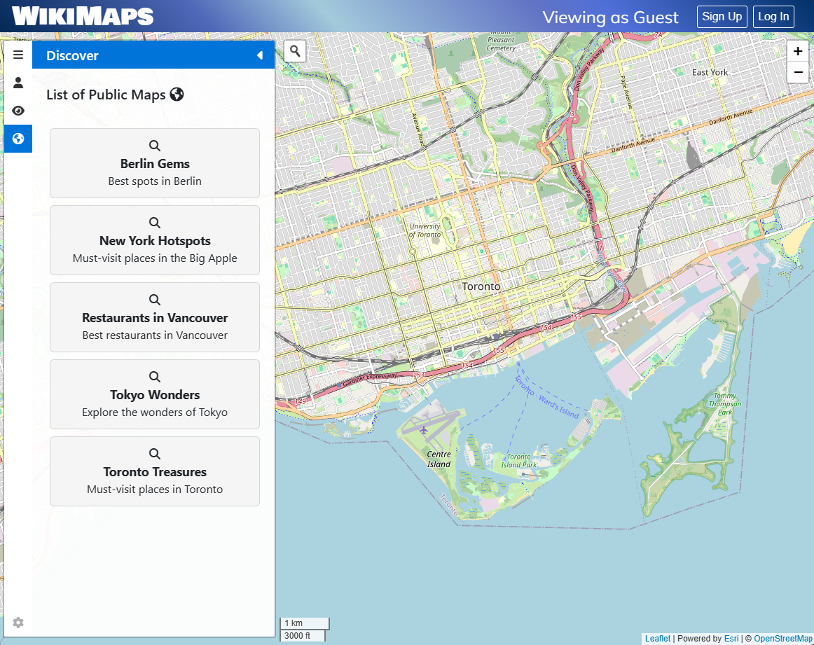
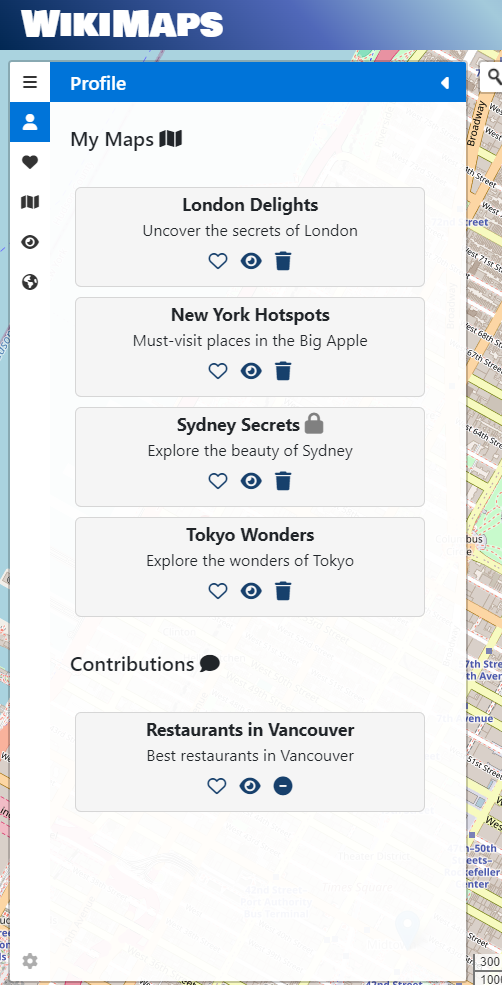
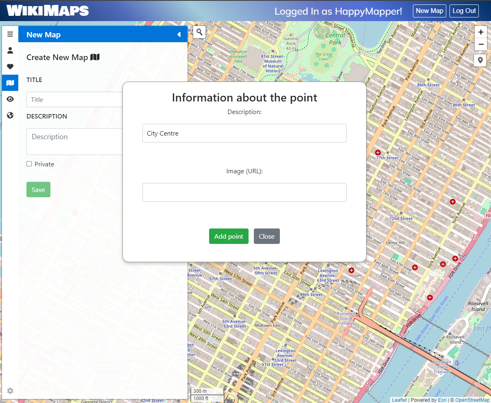
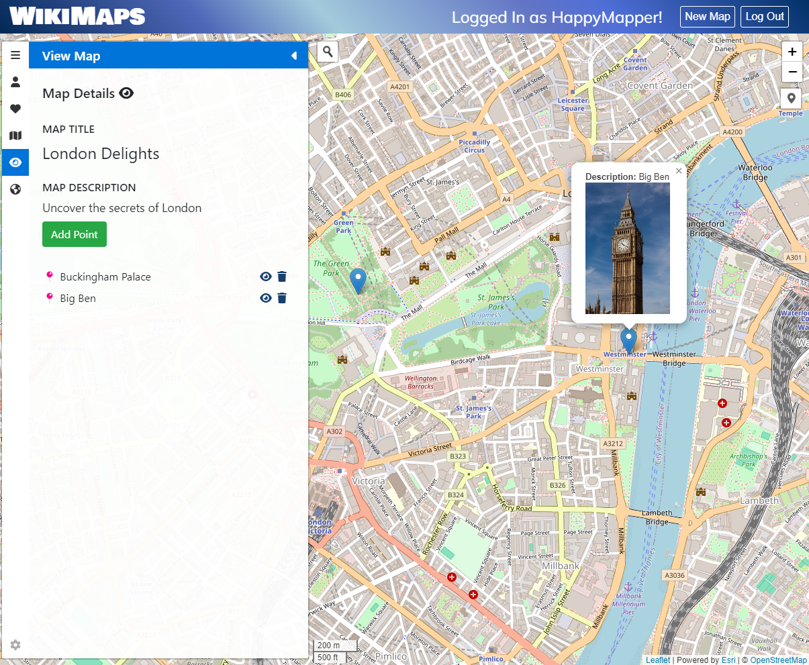
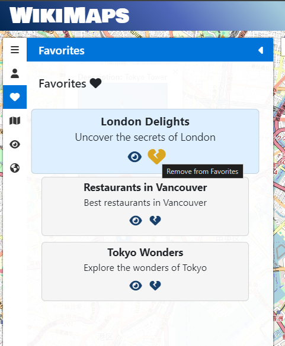
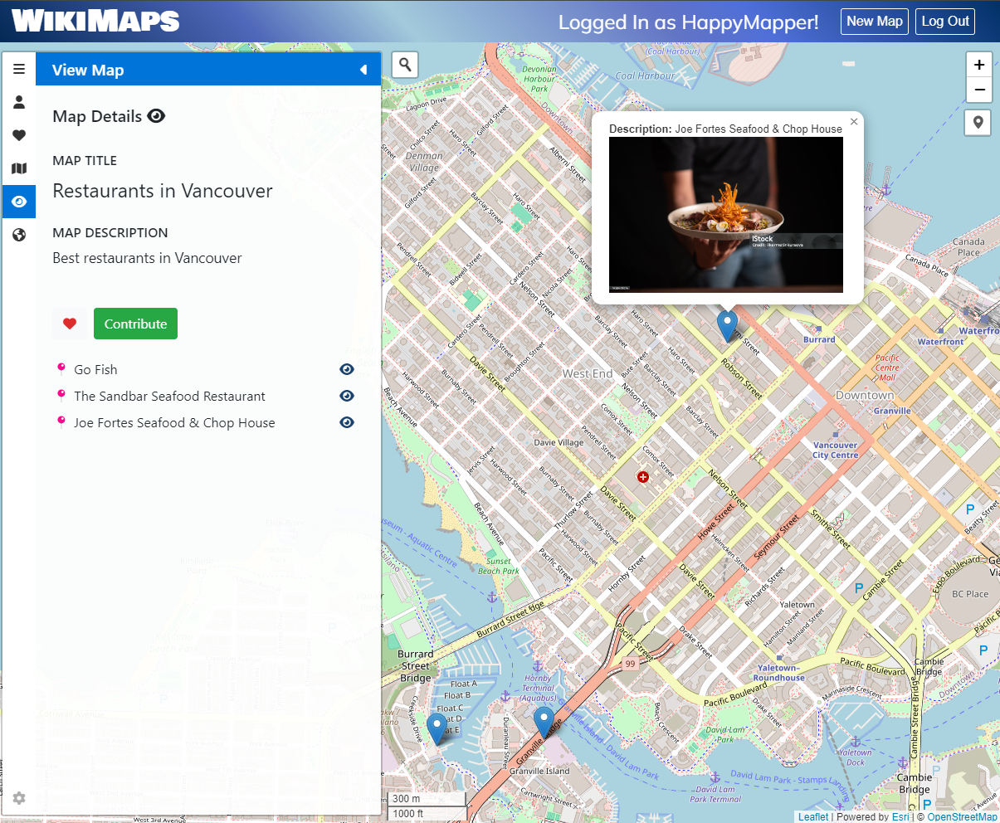
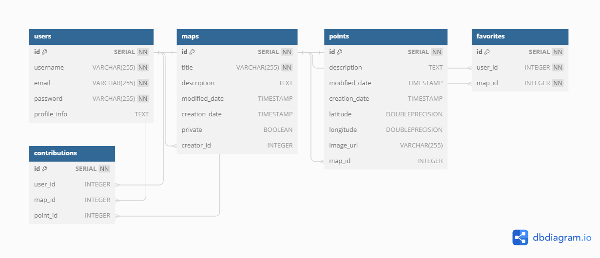

🌎 WikiMaps
=========

Welcome to WikiMaps - A collaborative mapping web app that allow users to create maps with various points of interest, keep a list of favorites and contribute to maps on the Discover page.

View WikiMaps app on your browser via one of these links:
- <a href="https://wikimaps-production.up.railway.app/">Wikimaps</a> - Hosted on Railway by <a href="https://github.com/svaronc">Sebastian Varon</a>
- <a href="https://wikimaps.up.railway.app/">Wikimaps</a> - Hosted on Railway by <a href="https://github.com/glowiep">Gloria Lim</a>

## ⭐ Features

1. Guests can explore a collection of public maps on the Discover tab.

2. Users can view their list of maps they own, and a list of maps they contributed to. 

3. Users can create new maps set as either Public or Private, and add points to the map (including a point description and image URL).

4. Users can add and delete points from a map they have created.

5. Users can keep a list of favorites.  

6. Users can contribute to public maps on the Discover page.

## 💬 Contributors
This was a Lighthouse Labs collaborative midterm project by:
- <a href="https://github.com/glowiep">Gloria Lim</a>
- <a href="https://github.com/svaronc">Sebastian Varon</a>

## 🏆 Project Goals

✅ Build a full-stack web application using the technologies and approaches learned to date.

✅ Turn requirements into a working product.

✅ Practice architecting an app in terms of UI/UX, Routes/API and Database.

✅ Use the major steps of software development to execute the project; user stories, wireframes, ERD, Routes, etc.

✅ Manage a multi-developer project with git while using git best practices.

✅ Collaborate with team members to decide how to break out the work, set good team structure, and dynamic.

✅ Present a web development project to a technical and non-technical audience.

## 📋 Entity Relationship Diagram

## 🔧 Dependencies

- Node 10.x or above
- NPM 5.x or above
- PG 6.x
- [bcrypt](https://www.npmjs.com/package/bcrypt)
- [chalk](https://www.npmjs.com/package/chalk)
- [cookie-session](https://www.npmjs.com/package/cookie-session)
- [dotenv](https://www.npmjs.com/package/dotenv)
- [ejs](https://www.npmjs.com/package/ejs) 
- [express](https://www.npmjs.com/package/express)
- [express-session](https://www.npmjs.com/package/express-session)
- [morgan](https://www.npmjs.com/package/morgan)
- [sass](https://www.npmjs.com/package/sass)

## 💡 Acknoledgements

- <a href="https://github.com/lighthouse-labs/node-skeleton"> Lighthouse Labs Node Skeleton</a>
- <a href="https://leafletjs.com/">Leaflet</a> Library - Open-source JavaScript library for mobile-friendly interactive maps
- <a href="https://www.openstreetmap.org/copyright">Open Street Maps</a> for base map layer
- <a href="https://github.com/Turbo87/sidebar-v2">leaflet-sidebar-v2</a> - Responsive sidebar plugin for Leaflet
- <a href="https://github.com/Esri/esri-leaflet-geocoder">ESRI Leaflet Geocoder</a> - Plugin to allow address search functionality in Leaflet.
- <a href="https://fontawesome.com/">Font Awesome</a> - Icon library and toolkit
- <a href="https://fonts.google.com/">Google Fonts</a> - Directory of open source fonts
- <a href="Railwayhttps://railway.app/">Railway</a> - Web App Hosting Platform
